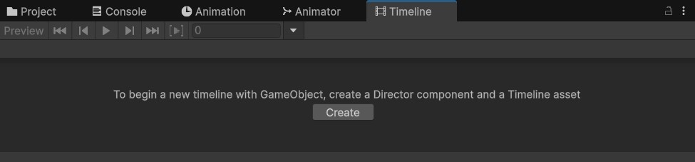

# 🎬 Creating a Cinematic with Timeline & Cinemachine

## 📦 1. Import Required Packages

Go to `Window > Package Manager` and install:

- ✅ `Timeline`
- ✅ `Cinemachine`

---

## 🧱 2. Set Up Your Scene

- 🎥 Ensure you have a `Main Camera` in the scene.
- ➕ Create an empty GameObject called `[cinematic-name]`.
    - Add the **Playable Director** component to it.

---

## 🕘 3. Create a Timeline Asset

1. Select the `[cinematic-name]` object.
2. Open Timeline window: `Window > Sequencing > Timeline`.
3. With the `[cinematic-name]` object selected click **Create** to make a new Timeline asset (e.g., `introTimeline.playable`).

---

## 🎞️ 4. Add Tracks to the Timeline

Inside the Timeline window:

- ➕ Add **Animation Track** → drag the animated character or object.
- ➕ Add **Audio Track** → drag and drop your audio clip.
- ➕ Add **Control Track** → to trigger particle systems, lights, etc.
- ➕ Add **Cinemachine Track** → to control virtual cameras.

---

## 🎥 5. Add and Use Cinemachine

1. Create virtual cameras:
    - `GameObject > Cinemachine > Virtual Camera`
2. Position them to match your shots.
3. In Timeline:
    - Add a **Cinemachine Track**
    - Link the `Main Camera` (with **CinemachineBrain**)
    - Add your **Virtual Cameras** as clips to the track.

✔️ Unity will automatically **blend between virtual cameras** if clips overlap.

---

## 🎯 6. Customize with Events and Details

- 🎯 Use **Animation Events** to trigger VFX, sounds, or scripts.
- 🧩 Use **Signal Tracks** for more advanced communication between Timeline and game logic.
- 🎛️ Sync cameras, animations, sound, and FX precisely in the Timeline.

---

## 🚀 7. Play the Cinematic

- On the `Playable Director` component:
    - ✅ Enable **Play On Awake**
    - Set **Wrap Mode** to `Hold` (so it doesn’t reset after playing)
- Press **Play** in the editor to preview.

---

## 🧠 Tips

- 🎬 Use multiple Timelines for different sequences or scenes.
- 🧩 Nest Timelines using **Control Tracks** for modular setup.
- 🧪 Combine **Signals + Timeline** for interactive moments.

---

[< back](../README.md)